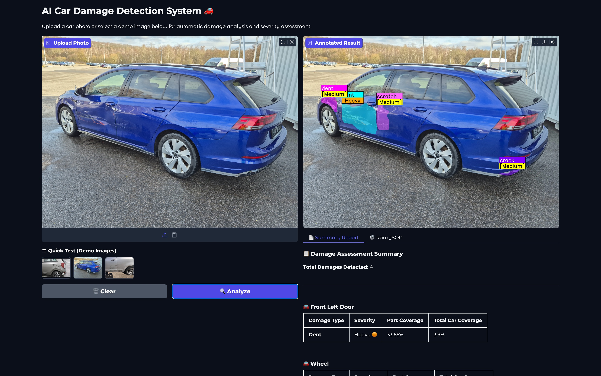
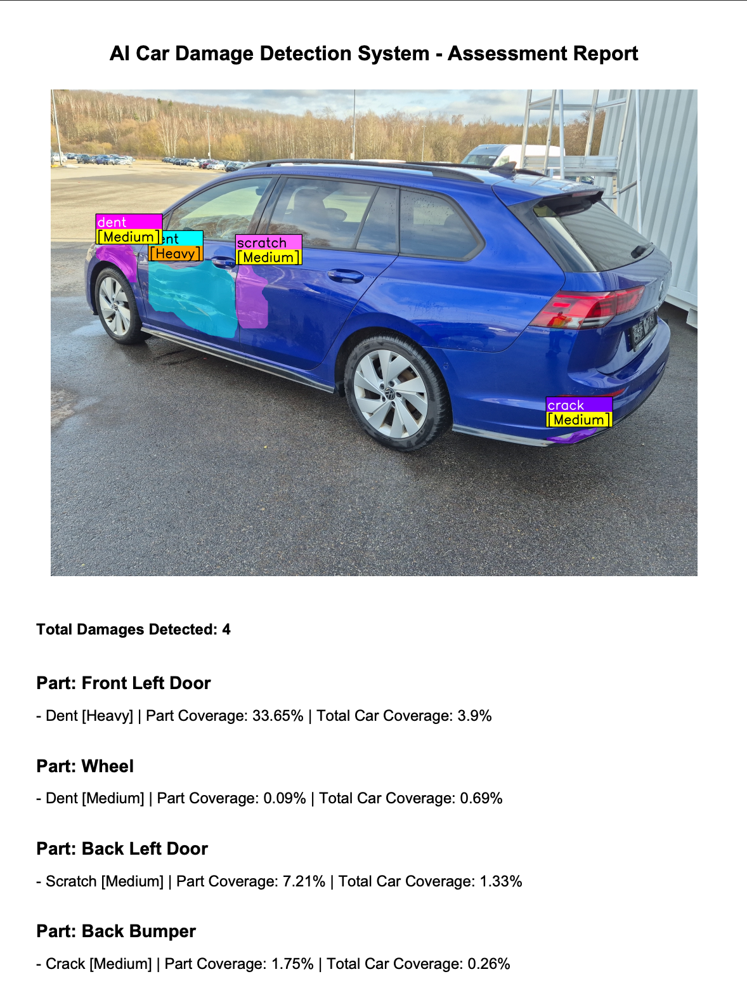

# 🚗 AI Car Damage Detection System

An automated vehicle damage assessment tool powered by a YOLO26 instance segmentation pipeline. See the full AI pipeline in action via an interactive Gradio dashboard that identifies car parts, detects defects, and generates structured PDF reports with objective severity scoring.

## 📋 Table of Contents

  * [📖 Project Overview](#-project-overview)
  * [📊 Data](#-data)
  * [🏗️ The AI Architecture (Pipeline)](#️-the-ai-architecture-pipeline)
  * [🧠 Training](#-training)
  * [🚧 Problems Faced During the Project](#-problems-faced-during-the-project)
  * [✨ Key Features](#-key-features)
  * [🖼️ UI Preview & Reporting Examples](#️-ui-preview--reporting-examples)
  * [⚙️ Installation & Running](#️-installation--running)


## 📖 Project Overview

This system is an automated tool for vehicle damage assessment. It processes car photos through a **3-stage AI pipeline** to isolate the vehicle, identify specific body parts (like doors or bumpers), and detect various types of damage, such as dents, scratches, or cracks.

The primary goal is to transform a standard image into a structured **PDF report** that includes a visual analysis and a severity breakdown for each affected part. The system is built using **Python 3.14**, **YOLO26m-seg (Ultralytics)** for instance segmentation, **Gradio** for the web interface, and is fully containerized with **Docker** for easy deployment.

## 📊 Data

The project utilizes a combination of specialized datasets to ensure high accuracy across car identification, part segmentation, and damage detection.

### Data Sources

The models were trained and validated using the following datasets:

  * **[CarDD Dataset](https://cardd-ustc.github.io/):** The primary source for car damage detection and instance segmentation masks.
  * **[Stanford Cars Dataset](https://www.kaggle.com/datasets/eduardo4jesus/stanford-cars-dataset):** Used to provide a wide variety of car makes and models to improve the system's robustness in different environments.
  * **[Ultralytics CarParts-Seg (car-seg)](https://docs.ultralytics.com/datasets/segment/carparts-seg/):** An open-source dataset focused on granular car part segmentation (doors, bumpers, lights, etc.).

### Final Dataset Composition

After processing, cleaning, and merging these sources, the final dataset was split as follows:

| Split | Number of Images |
| :--- | :--- |
| **Training** | 5,239 |
| **Validation** | 810 |
| **Testing** | 374 |

## 🏗️ The AI Architecture (Pipeline)

The entire system is powered by the [YOLO26](https://docs.ultralytics.com/models/yolo26/) architecture, specifically the **yolo26m-seg** (Medium) instance segmentation model. We chose this version because its deeper parameter structure is much better at distinguishing subtle textures — like a fine hairline crack versus a simple reflection — without being too heavy for a standard server.

### 1\. Vehicle Silhouette Isolation

The process starts with a pre-trained **yolo26m-seg** model. Its only job is to find the car in the image and create a global mask. This allows the system to crop out everything else—trees, buildings, or other cars in the background. By focusing the pipeline strictly on the car's silhouette, we significantly reduce the chance of the more sensitive models getting confused by environmental noise.

### 2\. Anatomy Mapping (Parts Model)

Once we have a clean crop of the vehicle, the fine-tuned **parts\_model** takes over. It segments the car into its functional components to create a structural "map." The model identifies panels such as:

  * Main body parts like the hood, doors, and bumpers.
  * Details like fenders, mirrors, and pillars.
  * Glass components and lighting units.

### 3\. Damage Detection (Damage Model)

The "Damage Specialist" is a fine-tuned model trained specifically to spot six categories of issues. To ensure it doesn't miss small surface defects, this stage runs at a high **896px resolution**. It looks for:

  * **Surface issues:** Dents and scratches.
  * **Structural damage:** Cracks and shattered glass.
  * **Component failure:** Broken lamps and flat tires.

### 4\. Calculation and Post-processing

After the models finish, the logic engine performs a pixel-wise intersection check. It overlays the damage masks onto the part masks to see exactly which component is affected. If a scratch mask is found on top of a door mask, the system logs it to that specific part.

The engine then calculates the percentage of the part covered by damage and assigns one of four severity levels:

  * **Light:** Very minor surface scratches or tiny, barely noticeable dents.
  * **Medium:** Clear, visible damage that requires standard bodywork or painting.
  * **Heavy:** Significant deformations or scratches covering a large portion of the panel.
  * **Critical / Replace:** Major issues that necessitate a full part replacement, such as shattered glass, broken lamps, or flat tires.

Finally, all this data is compiled into two formats: a **JSON export** for system integration and a **PDF report** for the end-user.

## 🧠 Training

The training process was the most challenging and rewarding part of the project. We moved from a baseline model that was essentially blind to subtle issues—like cracks—to a robust system capable of spotting even the smallest surface defects.

### The Kaggle Setup

Training was conducted using **Kaggle's dual Tesla T4 GPU** environment ($2 \times 15GB$ VRAM). To maximize this hardware, we utilized **Distributed Data Parallel (DDP)**, which effectively doubled our throughput. We also used disk caching (`cache='disk'`) to prevent the 30GB system RAM from freezing during the processing of our large-scale dataset.

### Solving the "Minority Class" Problem

Our biggest breakthrough was the improvement in Crack Recall (from 3% to 56%). Cracks are notoriously difficult because they are thin and often confused with reflections. We solved this using a **Probabilistic Class Balancing** strategy. By applying a custom `OVERSAMPLE_MAP`, we forced the model to "see" cracks 3x more often and tire/dent issues 2x more often during training. This ensured a perfectly balanced training pool without creating repetitive integer loops.

### The Training Blueprint

Several key technical choices were made to "move the needle" on model performance:

  * **Muon-style SGD (MuSGD):** We switched from the standard AdamW optimizer to MuSGD for the Medium model. This provided much smoother loss curves and prevented the model from getting stuck during the 100-epoch run.
  * **The 896px "Sweet Spot":** After testing various resolutions, 896px emerged as the winner. It provided enough detail for the model to find tiny edges without crashing the GPU memory.
  * **Precision Guardrails (Hard Backgrounds):** We integrated 500 "clean car" images into the training set. This taught the AI that a sun reflection on a shiny fender isn't necessarily a scratch, drastically reducing false positives.
  * **Hyperparameter Polishing:** We used high-intensity augmentations like `copy_paste=0.7` to synthetically generate thousands of new examples. In the final 10 epochs, we used `close_mosaic=10` to disable chaotic augmentations, allowing the model to fine-tune its mask boundaries on clean images.

### Final Results Summary

The resulting **yolo26m-seg** models reached a high level of maturity, ready for real-world pilot testing:

| Metric | Score (Mask) | Interpretation |
| :--- | :--- | :--- |
| **mAP50** | **0.781** | High accuracy in localizing and identifying damage types. |
| **mAP50-95** | **0.609** | Indicates accurate mask alignment with the actual edges of detected defects. |
| **Global Recall** | **0.755** | Catching \~76% of all damage instances. |
| **Inference Speed** | **11.2ms** | Roughly 89 images per second on a single T4. |

## 🚧 Problems Faced During the Project

While building the system, we encountered several technical hurdles that required specific data-engineering and architectural adjustments.

### Background Noise and Part Attribution

One of the main challenges was accurately identifying car parts in cluttered environments. The model would sometimes confuse background objects (like fences or pavement) with vehicle components. To solve this, we introduced the **Vehicle Silhouette Isolation** model as a mandatory first step. By "masking out" everything except the car, we ensured that the parts and damage models only processed pixels belonging to the vehicle, significantly improving reliability.

### The Challenge of Reflections

Car paint is highly reflective, which makes sun glares and light streaks look almost identical to scratches or cracks. Initially, this led to a high rate of false positives. To fix this, we added **500 hard negative background images** (clean cars with zero damage) to the training set. This taught the model to distinguish between light reflections and actual physical defects.

### Class Imbalance

Our starting dataset of roughly 4,000 images was heavily skewed toward common issues like dents and scratches. Minority classes, like cracks or flat tires, were often overlooked. We solved this by **oversampling these rare classes** within the training split. This forced the model to encounter these specific textures more often, which was the key to boosting our crack detection recall from nearly zero to a usable level.

### Texture and Depth Confusion

Distinguishing between a surface-level scratch and a structural dent is difficult in 2D because both rely on how light hits the panel. Low-resolution scans often resulted in "texture confusion" where the model couldn't tell the difference. Moving to a **higher 896px resolution** was essential to give the model enough detail to recognize the specific depth and contours of deformations.

## ✨ Key Features

While the core of the system is the AI, we’ve built several features around it to make the data actually useful for real-world scenarios.

### Interactive Web Dashboard

We used **Gradio** to build a clean, responsive interface that anyone can use without looking at code. You can drag and drop photos, run the analysis with one click, and see the results side-by-side. The original image is displayed next to the "Annotated Result," where all detected parts and damages are highlighted with semi-transparent masks and labels.

### PDF Reporting

One of the most practical features is the automated PDF generator. Once the analysis is complete, the system compiles a structured document that includes:

  * A summary of the total number of damages detected.
  * Close-up crops of each affected area.
  * A detailed table listing the damage type, which part of the car was hit, and the calculated severity.
    This report is ready to be saved or sent directly to an insurance provider.

### Automated Severity Assessment

Instead of just saying "there is a dent," the system actually quantifies it. By measuring the pixel area of the damage relative to the size of the car part, it objectively decides how bad the situation is. This removes a lot of the guesswork and provides a consistent standard for whether a part needs a simple polish or a full replacement.

### System-Ready JSON Export

For developers or companies that want to integrate this tool into their own software, the system exports everything as a clean **JSON file**. This includes all the raw coordinates, confidence scores, and coverage ratios, making it easy to pipe the AI's findings directly into a database or a CRM system.

## 🖼️ UI Preview & Reporting Examples

The system provides a clean, user-friendly interface for real-time analysis and professional data export.

### Gradio Dashboard

The web-based dashboard features a side-by-side comparison of the original upload and the **Annotated Result**. All detected parts and damages are displayed with semi-transparent masks and precise labels. An interactive table below the viewer provides an instant breakdown of all detected issues.



### Assessment Report

The system generates a structured PDF summary to document the findings. It provides a straightforward overview of the analysis, including:

  * **Annotated Visual:** The processed image with localized damage masks and labeled severity scores.
  * **Damage Summary:** The total count of detected defects.
  * **Part-by-Part Analysis:** A detailed list specifying the affected component, damage type, and coverage metrics (percentage of the part and total vehicle area) for each instance.



## ⚙️ Installation & Running

The system is designed to be easy to deploy. You can choose to run it directly on your machine or use a containerized environment for maximum consistency.

### Option 1: Local Installation

If you prefer to run the project directly, ensure you have **Python 3.14** or later installed.

1.  **Clone the repository:**

    ```bash
    git clone https://github.com/cloudwhynot/car-damage-detection-yolo.git
    cd car-damage-detection-yolo
    ```

2.  **Install the required packages:**

    ```bash
    pip install -r requirements.txt
    ```

3.  **Start the application:**

    ```bash
    python app.py
    ```

### Option 2: Docker

This is the fastest way to get the system running without worrying about local dependencies or specific library conflicts.

1.  **Build the image:**

    ```bash
    docker build -t car-damage-system .
    ```

2.  **Run the container:**

    ```bash
    docker run -p 7860:7860 --name damage-detector --rm car-damage-system
    ```

    Once the container is running, the web interface will be accessible at `http://localhost:7860`.